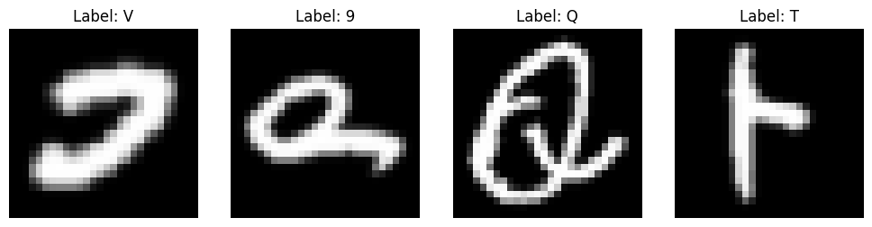
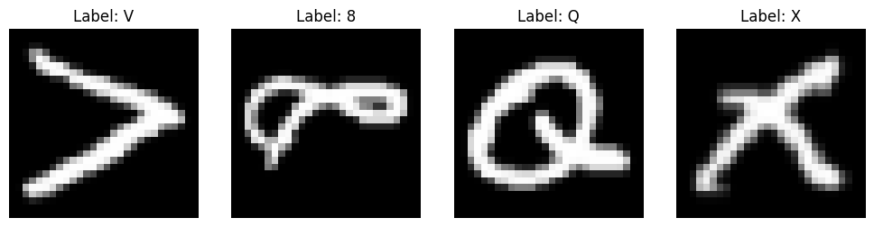
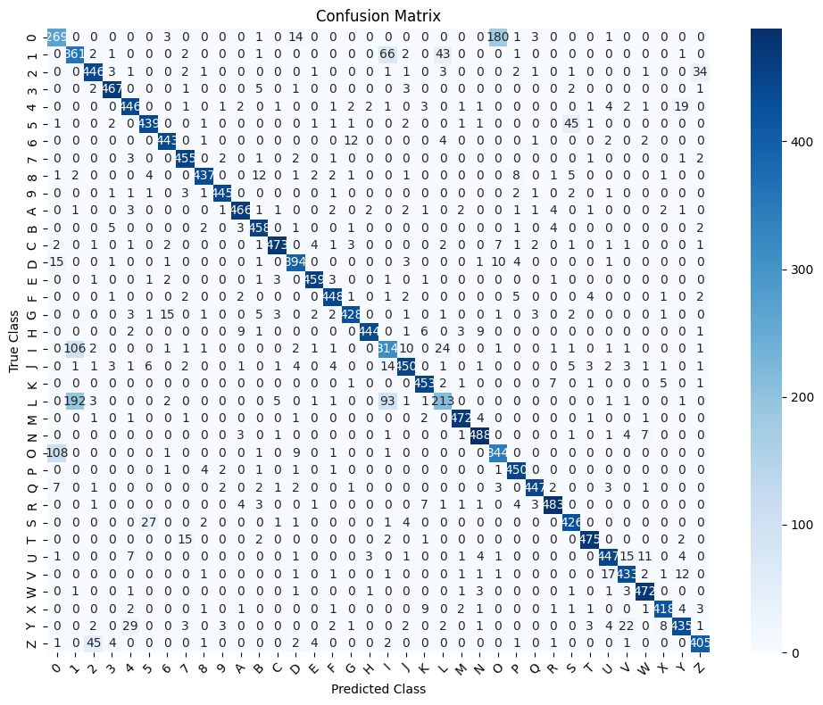

# Handwritten Digit and Character Recognition using EMNIST Dataset

This project implements a deep learning model to recognize both handwritten digits and characters using the EMNIST dataset. The EMNIST dataset is an extended version of the MNIST dataset, designed for both digit and character classification.

## Dataset

The EMNIST dataset consists of grayscale images of handwritten digits and letters, divided into multiple subsets (Balanced, ByClass, ByMerge, Digits, Letters, and MNIST). For this project, we use the **EMNIST Balanced** subset, which contains 47 classes (digits and letters).

You can learn more about the EMNIST dataset [here](https://www.nist.gov/itl/products-and-services/emnist-dataset).

## Model

The project uses a Convolutional Neural Network (CNN) for classifying the handwritten digits and characters. The CNN is designed to handle the complexity of multi-class classification with high accuracy.

## Results

The model achieves an accuracy of approximately **XX%** on the test dataset. Below are some visual representations of the results:

### Dataset Images

Here are a few samples from the EMNIST dataset:

  
  

### Metrics :

```
Accuracy: 0.8914
Classification Report:
              precision    recall  f1-score   support

           0       0.66      0.57      0.61       472
           1       0.54      0.75      0.63       480
           2       0.88      0.90      0.89       498
           3       0.96      0.97      0.96       482
           4       0.89      0.91      0.90       489
           5       0.92      0.89      0.90       496
           6       0.94      0.95      0.95       465
           7       0.93      0.97      0.95       468
           8       0.96      0.91      0.94       478
           9       0.98      0.97      0.97       459
           A       0.95      0.95      0.95       492
           B       0.92      0.96      0.94       477
           C       0.97      0.94      0.95       504
           D       0.90      0.91      0.91       431
           E       0.96      0.97      0.97       473
           F       0.95      0.96      0.95       469
           G       0.95      0.91      0.93       469
           H       0.98      0.93      0.96       476
           I       0.63      0.67      0.65       469
           J       0.93      0.89      0.91       506
...
    accuracy                           0.89     17280
   macro avg       0.89      0.89      0.89     17280
weighted avg       0.89      0.89      0.89     17280
```

The confusion matrix below illustrates the performance of the model across all classes:



